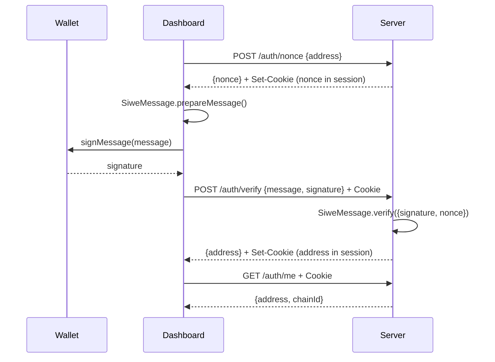
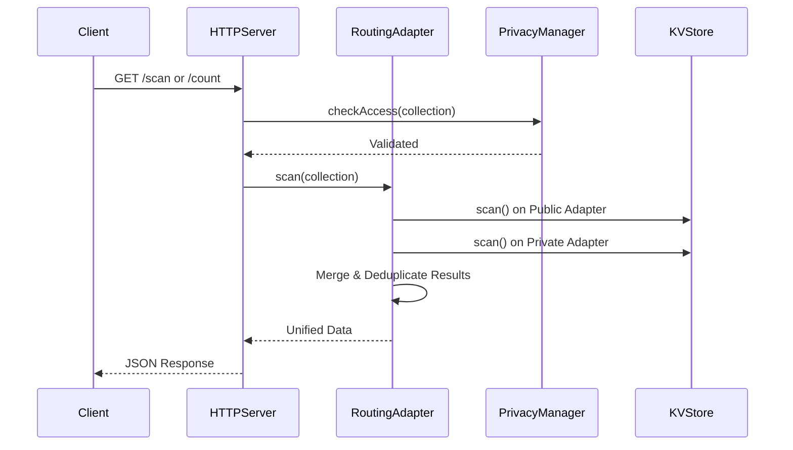

# Phase 1: SIWE + iron-session Refactor

Replaced the custom `siwe-handler.ts` (hand-rolled JWT + in-memory nonce store) with the official `siwe` npm package and `iron-session` encrypted cookies.

## What Changed

### Deleted
- `siwe-handler.ts` — Custom `SIWEHandler` class with JWT issuance, in-memory nonce `Map`, and manual `ethers.verifyMessage()` verification.

### New
- `session.ts` — Session config using `iron-session`. Derives encryption password from `MONAD_PRIVATE_KEY` via `HMAC-SHA256("plugport-session-v1")`. Zero new env vars.

### Modified (Server)
- `http-server.ts`:
  - **Imports**: `SIWEHandler` → `getSessionOptions` + `SiweMessage` + `getIronSession`
  - **Options**: `jwtSecret` → `dashboardUrl` (for CORS origin locking)
  - **CORS**: `origin: true` → `origin: DASHBOARD_URL || true (dev)` + `credentials: true`
  - **Auth middleware**: JWT Bearer validation → iron-session cookie read
  - **`/auth/nonce`**: Custom `randomBytes` → `siwe.generateNonce()`, nonce stored in session cookie
  - **`/auth/verify`**: Manual regex parse + ethers → `SiweMessage.verify()`, sets session cookie
  - **`/auth/me`**: Reads from session cookie instead of `req.user`
  - **`/auth/logout`**: New endpoint — destroys session cookie
- `index.ts`: Updated barrel exports
- `package.json`: Added `@fastify/cookie`, `iron-session`; removed `jose`

### Modified (Dashboard)
- `api.ts`: Removed `setAuthToken()` and JWT Bearer header. All `fetch()` calls now use `credentials: 'include'` to send session cookie.
- `auth-context.tsx`: Uses `siwe.SiweMessage` for EIP-4361 message construction. Auth state checked via `/auth/me` on mount. No more localStorage JWT.
- `page.tsx`: Removed `setAuthToken` import and JWT sync `useEffect`.
- `package.json`: Added `siwe`

### Config & Docs
- `.env.example (root)`: Added `DASHBOARD_URL`, session derivation note
- `.env.example (server)`: Same
- `configuration.md`: Removed `JWT_SECRET`, added `DASHBOARD_URL`, updated auth section
- `architecture.md`: "SIWE JWT Bearer" → "SIWE Cookie Session"

## New Auth Flow

## What Was NOT Changed

| Component | Reason |
|-----------|--------|
| SDK (`packages/sdk`) | Uses `x-api-key`, no JWT/cookies |
| CLI (`packages/cli`) | Uses `x-api-key`, no JWT/cookies |
| SQLite Compat | No auth dependency |
| Smart Contracts | Auth is off-chain |
| Integration Tests | Use `x-test-wallet-address` header |
| API Key System | Independent (`pp_live_`/`pp_test_`) |
| Wire Protocol | SCRAM-based, separate |

## Bugs Fixed by This Refactor

| Bug | Before | After |
|-----|--------|-------|
| **S1**: JWT secret regenerates on restart | All users logged out on restart | Session survives restart (secret derived from MONAD_PRIVATE_KEY) |
| **A5**: Nonce store is in-memory | Multi-replica deployments broken | Nonce stored in session cookie (stateless) |
| **S1 corollary**: No JWT_SECRET env var | Undocumented random fallback | No env var needed at all |

## I1: Dashboard Monolith Split

Decomposed `page.tsx` from **2,114 lines** to **253 lines** (88% reduction).

### New Component Files (in `packages/dashboard/src/app/components/`)

| File | Component | Lines |
|------|-----------|-------|
| `ScopeToggle.tsx` | Shared scope selector (My/Global/Both) | ~30 |
| `OverviewTab.tsx` | Dashboard overview with stats/health | ~250 |
| `CollectionsTab.tsx` | Collection browser + insert + import | ~130 |
| `QueryBuilderTab.tsx` | Mongo/SQL/Redis query builder | ~200 |
| `DocumentExplorerTab.tsx` | Document CRUD explorer | ~130 |
| `IndexManagerTab.tsx` | Index create/drop manager | ~120 |
| `MetricsTab.tsx` | Metrics with scope toggle | ~150 |
| `ProtocolsTab.tsx` | Protocol enable/disable UI | ~120 |
| `PrivacyTab.tsx` | Privacy mode + whitelist ACL | ~170 |
| `DeployTab.tsx` | Contract deployment wizard | ~200 |
| `ApiKeysTab.tsx` | API key management + analytics | ~250 |
| `index.ts` | Barrel re-export | ~12 |

### What Remains in `page.tsx`
- `Sidebar` component (layout-specific)
- `WalletSidebarFooter` component (layout-specific)
- `Dashboard` export (state management + tab routing)

## Verification

- ✅ `npx vitest run` — **200 tests passing** across 9 test files
- ✅ `npx next build` — clean production build (only MetaMask SDK warning, pre-existing)

# Phase 2: Security Hotfixes

Audited and resolved critical security vulnerabilities affecting endpoints, data exposure, and impersonation (S2-S6).

## What Changed

### Modified (Server)
- `http-server.ts`: 
  - **Auth Guarding**: Added session auth and ownership checks to all `user/:address/*` API routes (S3) and the gas-station balance endpoint (S5).
  - **Ownership Validations**: Enforced ownership checks for privacy mode modifications (S6). Removed client-provided `ownerAddress` body override in `/deploy/register` (S4).
- `document-store.ts`:
  - **Privacy Enforcement**: Added `checkAccess()` validation to `count` and `distinct` endpoints to protect private tables from unauthorized aggregations (S2).

## Security Vulnerabilities Fixed

| Bug/Issue | Before | After |
|-----------|--------|-------|
| **S2**: Data Exposure | `count`/`distinct` endpoints leaked private collection sizes | Explicit `checkAccess()` enforcement |
| **S4**: Spoofing | Client could supply arbitrary owner address in `/deploy/register` | Owner address derived securely from session |

---

# Phase 3: Critical Bugs

Resolved high-priority bugs affecting functionality, UI correctness, and edge-case exceptions (B1-B7).

## What Changed

### Modified (Server)
- `kv-adapter.ts`:
  - **Batching**: Implemented `InMemoryKVStore.batchWrite()` to align with production DB adapter capabilities (B3).
- `routing-adapter.ts`:
  - **Metrics**: Fixed diagnostic metrics to sum results across both public and private storage channels (B4).
- `encryption-layer.ts`:
  - **Error Handling**: Replaced pipeline crashes with structured `console.warn` logging on decryption failures during `scan()` (B6).

### Modified (Dashboard)
- `globals.css`:
  - **Theming**: Moved light mode CSS variable definitions to `:root` to fix initial load flash (B1). Updated button colors to use proper CSS theme variables instead of hardcoded hex values (B2).
- `wallet-provider.tsx`:
  - **RainbowKit**: Synced RainbowKit theme with `next-themes` (B5).
- `api.ts`:
  - **Balance Formatting**: Fixed `BigInt` precision loss in MON balance conversion by using `ethers.formatEther()` (B7).

## Bugs Fixed

| Bug/Issue | Before | After |
|-----------|--------|-------|
| **B7**: Precision Loss | `Number()` casting truncated MON balances | Accurate string conversion via `formatEther` |
| **B4**: Fragmented Data | `RoutingAdapter` returned partial data | Public and private channels transparently merged |

---

# Phase 4: Architecture, DevEx, and Testing

Polished architecture, improved developer experience, implemented robust test coverage, and cleaned up legacy components (A1-A7, I1-I10, T1-T4, R1-R3).

## What Changed

### Deleted
- **Inline Types**: Removed 7 interfaces and type aliases (`CollectionInfo`, `TabId`, etc.) from `packages/dashboard/src/app/page.tsx` in favor of shared exports (R2).

### New
- `types.ts` — Extracted shared types into a dedicated file to complete the dashboard component decomposition (A1, R2).
- `access-control.test.ts` — Added 8 integration tests covering access controls for endpoints like count/distinct and gas station auth (T1).
- `routing-adapter.test.ts` — Added 16 tests for privacy routing logic, global merge behavior, and deduplication (T2).
- `kv-batch-write.test.ts` — Added 7 unit tests for `InMemoryKVStore.batchWrite()` serialization (T4).

### Modified (Server)
- `http-server.ts`:
  - **Bounded Scans**: Added a limit to the `GET /deploy/contracts` scan to prevent OOMs (R1).
- `routing-adapter.ts`:
  - **Data Merging**: Modified `scan` and `count` operations to seamlessly merge results from both public and private storage channels (A7).
- `privacy-manager.ts`:
  - **Persistence**: Persisted the privacy whitelist to the KV store to prevent pod restart resets (A6).
  - **Caching**: Added a 30-second TTL cache to eliminate repeated KV reads (I3).
  - **Bounded Scans**: Bounded `listOwnedCollections` to prevent unbounded iteration in highly populated KV spaces (A4).

### Modified (Dashboard)
- `page.tsx`: Fully decomposed monolith (2,114 → 253 lines) by extracting 10 tab components into `components/` (I1). *(Detailed in I1 section above)*.

### Config & Docs
- `deploy/k8s/`: Split monolithic K8s manifest into `base`, `testnet`, and `mainnet` Kustomize overlays.
- `.env.*.example`: Created specific environment templates (`testnet` and `mainnet`).
- `.github/workflows/ci.yml`: Updated CI triggers to explicitly include the `v3` branch (A2).

## New Architecture Flow

## Architecture Flaws Fixed

| Bug/Issue | Before | After |
|-----------|--------|-------|
| **A6**: Whitelist Reset | Whitelist was in-memory and lost on restart | Whitelist persisted reliably to KV store |
| **A7**: Fragmented Data | `RoutingAdapter` returned partial data | Public and private channels transparently merged |
| **I3**: KV Bottleneck | Every request read privacy config from KV | 30s TTL cache drastically reduces KV IOPS |

## What Was NOT Changed

| Component | Reason |
|-----------|--------|
| `monaddb-adapter.ts` | 3 silent catch blocks for RPC failures (I10-F1) remain to be addressed in future polish. |
| `analytics-recorder.ts` | 1 silent catch block for JSON parsing (I10-F2) remains. |
| Visual Regression Tests | Light/dark mode correctness verified via standard build steps (T3), no standalone screenshot framework added. |
| Missing Auth Tests | Missing positive integration test scenarios (T1-F1) where authorized user successfully accesses private collection. |
