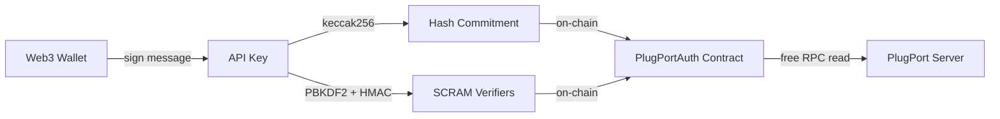
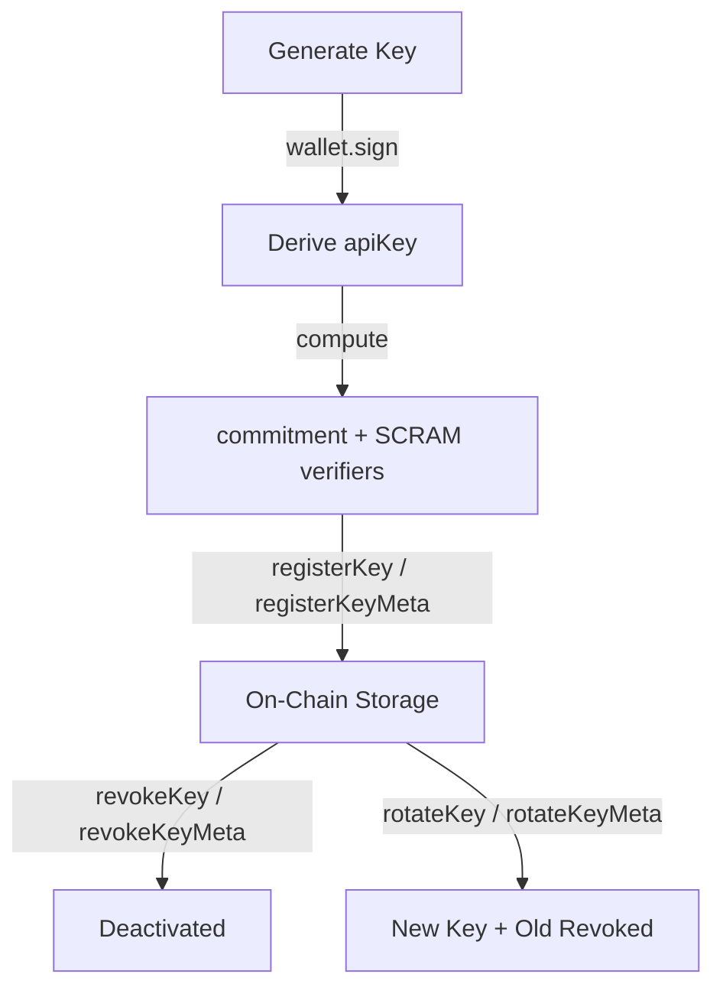

# Authentication

PlugPort uses a Web3-native authentication model where API keys are derived from your wallet and verified on-chain. This ensures self-sovereign key management — only you can create, revoke, or recover your API keys.

## Overview



## Wallet-Derived API Keys

API keys are derived deterministically from your Web3 wallet signature:

```
apiKey = keccak256(wallet.sign("PlugPort API Key #<index> for <address>"))
```

- **Deterministic**: Same wallet + same message = same key every time.
- **Multiple keys**: Use different derivation indices (`#0`, `#1`, `#2`...) for multiple keys.
- **Recoverable**: Re-sign the same message with your wallet to recover any key.
- **Never stored**: The raw API key is displayed once at generation time and never stored anywhere.

## Hash Commitment Validation

Instead of storing raw API keys, PlugPort stores `keccak256(apiKey)` on-chain as a **hash commitment**:

- The server never stores or sees the raw API key.
- Even if the contract storage is fully compromised, attackers only get hashes.
- Reversing `keccak256` is computationally infeasible.
- Validation: `keccak256(providedKey) === storedCommitment`.

## SCRAM-SHA-256 (Wire Protocol)

For MongoDB wire protocol connections (`mongosh`, drivers), PlugPort supports SCRAM-SHA-256 — the default authentication mechanism since MongoDB 4.0.

### How It Works

1. **saslStart**: Client sends `client-first-message` with username and client nonce. The username can be a wallet address (`0xAddress`) to use the first active key, or `0xAddress:N` to specify a specific key index. Server reads SCRAM verifiers from the `PlugPortAuth` contract (free RPC call) and returns `server-first-message` with salt and iteration count.

2. **saslContinue**: Client computes `ClientProof` and sends `client-final-message`. Server verifies the proof against the on-chain `StoredKey`. If valid, server returns `ServerSignature` for mutual authentication.

### SCRAM Verifiers

When a key is registered, the following SCRAM verifiers are computed and stored on-chain:

| Verifier | Derivation | Purpose |
|----------|-----------|---------|
| `salt` | `keccak256(walletAddress, keyIndex)` | Deterministic, per-user, per-key |
| `StoredKey` | `SHA-256(HMAC(PBKDF2(apiKey, salt, 4096), "Client Key"))` | Verifies client proof |
| `ServerKey` | `HMAC(PBKDF2(apiKey, salt, 4096), "Server Key")` | Mutual authentication |

### PLAIN Authentication (Fallback)

PlugPort also supports PLAIN mechanism as a fallback. The API key is sent as the password and validated against the on-chain hash commitment.

## PlugPortAuth Contract

The `PlugPortAuth` smart contract manages all authentication state on-chain.

### Key Lifecycle



All key management operations have both direct (user pays gas) and meta-transaction (gas station pays gas) variants.

### Gas Station (Meta-Transactions)

Users never need to hold MON to manage their API keys. The PlugPort server includes a **gas station** wallet that sponsors authentication transactions:

1. User signs an EIP-712 typed message in the dashboard.
2. Dashboard sends the signature + parameters to the server.
3. Server's gas station wallet calls the meta-transaction function (`registerKeyMeta`, `revokeKeyMeta`, or `rotateKeyMeta`) on-chain.
4. Contract verifies the EIP-712 signature via `ecrecover`.
5. Operation executes under the user's address. Gas is paid by the gas station.

Nonce-based replay protection prevents reuse of signed meta-transactions.

### Key Recovery

To recover your API keys:

1. Connect your wallet in the dashboard.
2. Click "Recover Keys".
3. The dashboard iterates derivation indices (0, 1, 2...) and re-signs each message.
4. For each derived key, it checks `PlugPortAuth.isKeyActive(address, index)`.
5. All active (non-revoked) keys are displayed.

## Security Constraints

- **Self-sovereign**: Only `msg.sender` (direct) or verified EIP-712 signer (meta-tx) can register/revoke their own keys. No admin can modify another user's keys.
- **Key limit**: Maximum 10 API keys per wallet address to prevent on-chain storage abuse.
- **Owner isolation**: The contract `owner` role only controls gas station transfer — it has zero access to user key management.
- **Gas station restriction**: The gas station can only relay user-signed meta-transactions — it cannot forge key operations without a valid signature.
- **Replay protection**: Nonce-based replay protection prevents reuse of signed meta-transactions.
- **One-way verifiers**: SCRAM verifiers (`StoredKey`, `ServerKey`) are one-way derivations — leaking them does not reveal the API key.
- **Irreversible commitments**: Hash commitments (`keccak256`) are irreversible — on-chain data cannot be used to recover raw keys.
- **Immediate revocation**: Key revocation is immediate and on-chain — revoked keys fail auth on the very next request.

## Environment Variables

| Variable | Description |
|----------|-------------|
| `AUTH_CONTRACT_ADDRESS` | Deployed PlugPortAuth contract address on Monad |
| `AUTH_GAS_STATION_PRIVATE_KEY` | Private key for the gas station wallet (separate from `MONAD_PRIVATE_KEY` for production isolation) |

## HTTP API Authentication

For REST API requests, include your API key in the `x-api-key` header:

```bash
curl -X POST http://localhost:8080/api/v1/collections/users/find \
  -H "Content-Type: application/json" \
  -H "x-api-key: YOUR_API_KEY" \
  -d '{"filter": {}}'
```

The server computes `keccak256(apiKey)` and validates it against the `PlugPortAuth` contract via a free RPC read.
